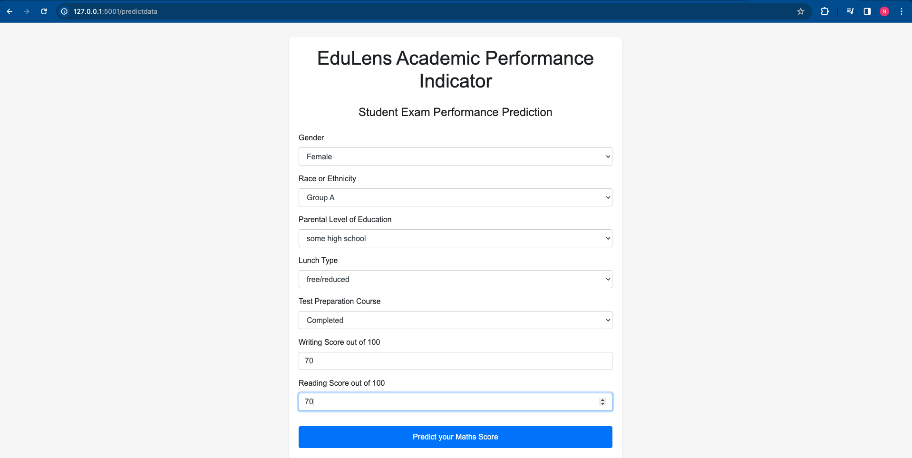
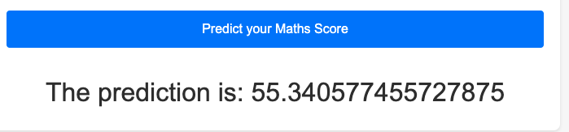

## EduLens : A Study on Student Performance

# EduLens: Advanced Student Performance Analysis System

## Introduction
EduLens is an end-to-end solution designed for analyzing and predicting student performance. This robust system integrates various stages of data handling, from ingestion and transformation to live data execution, providing an extensive analysis platform for educational data using .

## Features
- **Data Ingestion**: Efficiently handles the extraction of student data, ensuring a seamless flow into the system.
- **Data Transformation**: Employs advanced algorithms for processing and transforming data, preparing it for predictive analysis.
- **Predictive Analysis**: Utilizes machine learning models to predict student performance, offering valuable insights.
- **Live Data Execution Pipeline**: Capable of processing real-time data, ensuring up-to-date analysis and predictions.
- **User-Friendly Interface**: Provides an interactive platform for easy access to the system's functionalities.

## Evaluated Models
EduLens rigorously evaluates several machine learning models to ensure accurate predictions. The models include:
- Linear Regression
- Decision Tree
- Random Forest
- Gradient Boosting
- XGBoost
- CatBoost
- AdaBoost


## Technologies
EduLens is built using a variety of technologies:
- Python: For backend development and data processing.
- Flask: A lightweight web framework for serving the application.
- Jupyter Notebook: Used for interactive data analysis and model building.
- Pandas, NumPy, Scikit-Learn: Essential libraries for data manipulation and machine learning.
- HTML/CSS: For crafting a user-friendly interface.

## Installation and Usage
1. Clone the repository:
   ```bash
   git clone https://github.com/nithingovindugari/EduLens.git

2. Install dependencies:

   ```bash
   pip install -r requirements.txt

3. Run the application:

   ```bash
   python app.py

4. Open the application in your browser:

   ```bash
   http://localhost:5000/

# Dataset has been simplified due to GitHub's file size restrictions. 


# Sample Test


# Results


